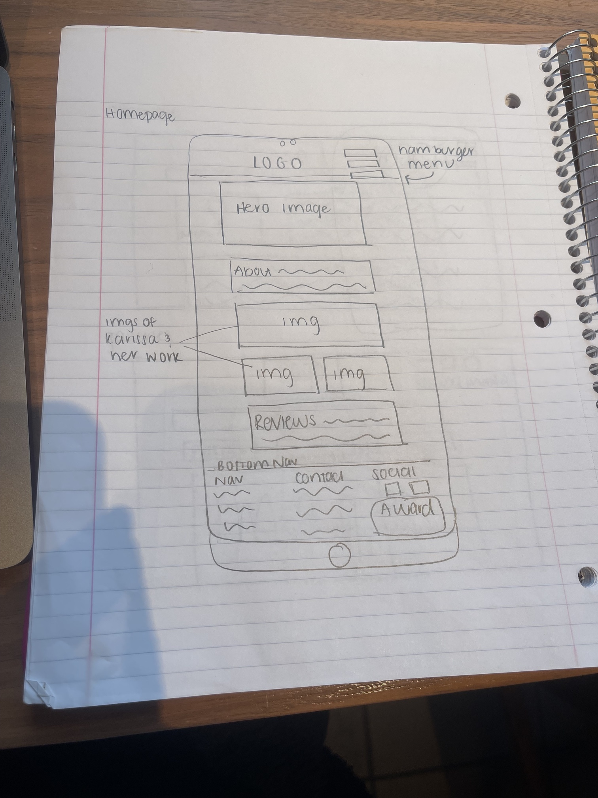
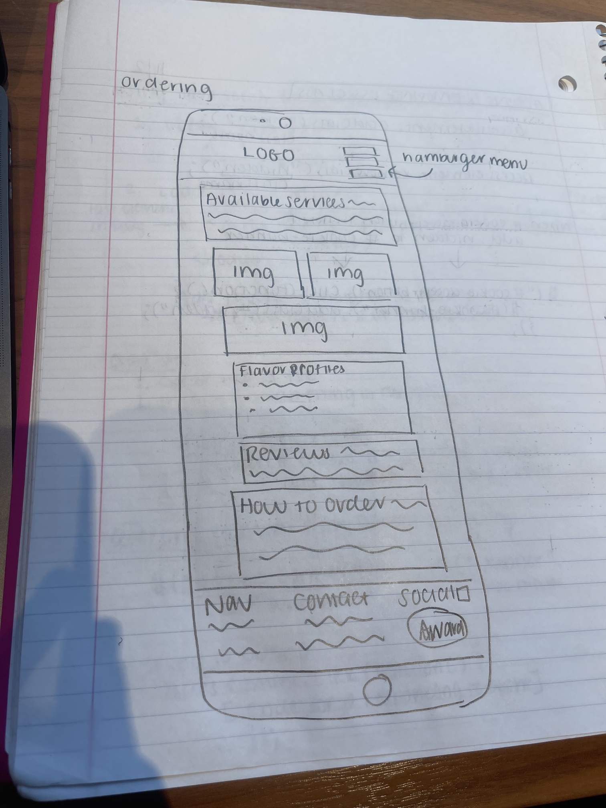

# Group Project: Design Journey

**You are encouraged to work ahead on everything on this project.** (Though we suggest you hold back on the interactivity until Project 3.) **Each section is required for a specific milestone. You are required to have these sections completed before that milestone's deadline.**

**Be clear and concise in your writing.** Bullets points are encouraged.

**Everything, including images, must be visible in Markdown Preview.** If it's not visible in Markdown Preview, then we won't grade it. We won't give you partial credit either. This is your warning.


# Client (Milestone 1)

## Client Questionnaire (Milestone 1)

1. Describe Karissa's Cakes. What is your goal with this company?

- started as a hobby
  - bdays, baby showers
- now it's a full-time business
  - immediately booked months in advance
- looking to expand to a location:
  - Roxie's Sweet Shoppe:
    - cupcake bar
    - available treats
  - Barn:
    - wedding venue
    - bakery location
- providing fun, custom cakes

2. What makes Karissa's Cakes and its services special or unique?

- homemade treats
- custom treats
- up to any challenge
- "It's an art to me."
- "It looks better. It tastes better. It's a better experience."

3. Tell me about Karissa. What would you want your customers to know about you?

- started business as a hobby while pregnant and working on a masters (masters in health with an obesity focus)
- graduated 4.2 gpa
- started as a family with her husband, but now she's a single mom
  - successful on her own
  - kid involvement
    - Harper does fondant for family events
- likes to do charity events (SPCA, stuff to support troops)
- very active locally (baseball coach, soccer coach)
- works with Darlene's Cakes when she can't fill an order

4. Why are you looking for a new website?

- no time to build
- tons of business from social immediately- wants home base for it all (including ordering and contacting (maybe not for this scope because of forms))

5. Who do you want to visit your site? Who is your site's target audience?

- birthdays, fondant work, and fun cakes
- brides (sees necessity, can do it, but hates doing weddings...boring)

6. When visiting your site, what actions do you want your visitors to take?

- gallery filtering
  - wedding
  - kids
    - characters
- area to leave feedback (maybe not for this scope because of forms)
  - can this be tied to/pulled from Facebook

7. What are your goals for this site?

- hub to bring together social media elements
- professional face to company
- wants to hit on internet searches
- share info about awards

8. Is there a "feel" that you want for your site? Are there colors or imagery that you have in mind?

- fun, imaginative, playful, cute (but not like Sesame Street)
- has a logo to include
  - black or white text
  - logo changes based on event (cakes)
- pink & teal, some blue
- polka dots, sprinkles, glitter

9. Are there any sites you've looked that that have given you ideas for how you want your site to look and/or function? What are they, what to you like about them, and why?

- long ago, nothing that is remembered

10. What do you think about https://www.jillycakesorlando.com/? Is there anything you really like about this site? If yes, what and why?

- likes the color and sprinkles
- bright & colorful, but classy
- like the footer
- likes the Meet part on the homepage, but not the gallery
- likes cupcake flavor page
  - wants cupcake/cake gallery

11. What do you think about http://www.sweetdelight.eu/? Is there anything you really like about this site? If yes, what and why?

- hero image is unappealing
- too bland/boring
- yuck

12. What do you think about https://www.tartsdefeybesse.com/? Is there anything you really like about this site? If yes, what and why?

- yuck

13. What do you think about https://billysbakerynyc.com/collections/party-supplies? Is there anything you really like about this site? If yes, what and why?

- likes the video
  - kid
  - giving
  - clean
  - local feel
  - sponginess of cake
- fun homepage gallery
  - likes space between images
- likes Testimonials
  - use "Testimonials" rather than "Feedback"
- likes the idea of a shares, news, articles, etc. section
- like community page (sees as a chance to share community work KC does)

14. How often do you want to meet to review how the website is coming along?

- pretty hands off until final review
- can be reached for content
- asks that we design with growth in mind


## Client Description (Milestone 1)
> Tell us about your client. Who is your client?
> Explain why your client meets the client rules in the project requirements.

Our client is Karissa of Karissa's Cakes. She is an award-winning local baker, currently customizing in cakes and cupcakes. She is very busy with order, often being booked out months in advance.


## Client Website (Milestone 1)
> Tell us about the website that your client wants. Tell us the purpose of the website and what it is all about.

Karissa wants a fun, professional website to will serve as the hub of the business. There are currently several social media accounts for Karissa's Cakes and she would like a website that brings them all together. Karissa would like to use the site to display previous works, share information about herself, and share information about the charitable work done by the company.

The purpose of the site is to convey to potential customers the breadth of cakes Karissa can make and to convince them that they should order their next cake from Karissa's Cakes. She plans to do this by sharing images of past works, making sure users understand that any cake they dream of is possible, and providing sample flavor profiles for cakes and/or cupcakes.


## Client Website Scope (Milestone 1)
> Your project should be ambitious, but not too large. A good rule-of-thumb is that you should have about 1 content-full page for each team member.
> Explain why the website you will create for your client isn't too small and isn't too big. Explain why you think it's the right size for this project.

While the customer would truly like a website of slightly larger scope, she understands that the limitations of this project will not allow us to develop ordering forms, contact forms, or feedback forms for the site. The site will likely include a home page, gallery page, flavor profile page, testimonials, "about me", and information of charitable works and awards. We estimate this can be done in 4-6 pages. Depending on the organization of the gallery work, there could be multiple pages of smaller galleries, but these would likely be coded almost identically, with varying images.


## Client Goals (Milestone 1)
> What kind of website do they want? What are their goals for the site?
> There is no required number of goals. You need as many goals as necessary to reflect your client's desires.

- Goal A: Have a site that will come up in Google searches on the company (rather than social media sites).
- Goal B: Introduce customers and potential customers to the woman (and kids) behind the cakes.
- Goal C: Provide customers and potential customers with plenty of inspiration for their cake desires.


## First Client Meeting Minutes/Notes (Milestone 1)
> Include your notes/minutes from the client meeting.

10:00 am  - Introduction between Karissa and James
          - Karissa's daughter is in James' daughter's class and Karissa heard of this opportunity through a mutual friend of James' that is James' daughter's den leader
          - James explained the scope of the project and offered to work w/ Karissa after the project to help her with the final elements that fall outside the project guidelines
10:10 am  - beginning of interview questions
          - see Client Questionnaire above for answers
11:00 am  - Karissa and James thanked each another
          - design of website should be built with growth in mind


# Plan/Schedule (Milestone 1)
> Make a plan of when you will complete all parts of this assignment.
> This plan is for your team. There is no required format. Format it so that it works for you!

https://airtable.com/shruvB7hRxCKveQ1u

Please view this plan to see the dates we would like to have different aspects of the project done, and who is first and foremost in charge of it. We will make sure to check each other's work and help out with different parts we aren't necessarily in charge of. Also, please see that some components are signed to the group as a whole. For those components we will work on them depending on our schedules for that week.

# Site Design/Plan (Milestone 2)

**Make the case for your decisions using concepts from class, as well as other design principles, theories, examples, and cases from outside of class.**

You can use bullet points and lists, or full paragraphs, or a combo, whichever is appropriate. The writing should be solid draft quality but doesn't have to be fancy.

## Understanding Users (Milestone 2)

### Audience (Milestone 2)
> Briefly explain your site's audience. Be specific and justify why this audience is a cohesive group with regard to your client's site. This audience should not be overly broad nor arbitrarily specific. It should be a cohesive group with similar _goals_.

Our site's audience is users in Dryden and the surrounding areas that are interested in purchasing cakes or cupcakes and want alternatives to grocery store cakes/cupcakes.


### User Interview Questions (Milestone 2)
> Plan the user interview which you'll use to identify the goals of your site's audience.

**User Interview Briefing & Consent:** Hi, I am a student at Cornell University. I'm currently taking a class on web design and for a project I am (re-)designing a web site for _client's name_. I'm trying to learn more about the people that might use this site. May I ask you a few questions? It will take about 10-15 minutes. You are free to quit at any time.

Rough Questions:
- When you order cakes/cupcakes, do you prefer to buy from grocery or chain vendor or do you prefer ordering from a local vendor? Why?
- What was the last kind of cake/cupcakes you bought?
- How did you learn about Karissa’s Cakes before ordering from Karissa? (When you last ordered a cake/cupcakes, how did you learn about the vendor?
- When you last purchased a cake/cupcakes, what details were you looking for?
- Why did you choose Karissa’s Cakes (or your chosen vendor) for your last cake/cupcake purchase?
- When you order cakes/cupcakes, do you prefer to buy online or offline? Why?
- Do you order cakes/cupcakes frequently or occasionally, when do you order?(ex. on the way to work, parties, for dinner and etc)

Final Questions:
Intro: Please tell me a little bit about yourself (age, occupation, where you're from)

General buyers trends:
1. Under what circumstances do you look for a bakery versus going to a grocery store? In your opinion, what are the pros and cons for both?
2. When you last purchased a cake/cupcakes, what details were you looking for?
3. How would you rate these three things in terms of importance in your decision making: reviews, photos, detailed descriptions. Is there any other information that you prefer to know before buying from a new bakery or store?

Karissa's Cakes:
1. How did you find Karissa's Cakes originally?
2. Did you have other bakeries that you were looking at? If so, why did you choose Karissa's Cakes? What makes her unique?
3. What was the last item you bought from Karissa's Cakes? What did you buy it for?


**After the interview:** This was really helpful. Thank you so much for agreeing to speak with me today. Have a great day!


### Interview Notes (Milestone 2)
> Interview at least 4 people from your audience. Take notes and include those notes here. Make sure to include a brief description of each interviewee.

**Interviewee 1:**

Intro: Please tell me a little bit about yourself (age, occupation, where you're from)
Name: Aiyana Green
Age: 21
Occupation: Senior Cornell student

General buyers trends:
1. Under what circumstances do you look for a bakery versus going to a grocery store? In your opinion, what are the pros and cons for both?
- She would go to a bakery if she were looking for something nice
- if planning in advanced
- bakeries are more expensive and take longer, would need to give them advanced notice
- bakeries have higher quality but they're more expensive
- grocery stores have wider selection, lower price, no need to plan in advance

2. When you last purchased a cake/cupcakes, what details were you looking for?
- She purchased them for a friends birthday in September at Wegmans
- placed the order the day before, needed it to be ready in time
- wanted the flavors she was looking for
- customization: happy birthday on it w name

3. How would you rate these three things in terms of importance in your decision making: reviews, photos, detailed descriptions. Is there any other information that you prefer to know before buying from a new bakery or store?
- reviews, photos, detailed descriptions
- not her personally but a lot of her friends have eating restrictions so gluten free, dairy free, do they have alternatives


**Interviewee 2:**
Intro: Please tell me a little bit about yourself (age, occupation, where you're from)
Name: Hawa Barry
Age: 21
Occupation: Senior Cornell student from NYC

General buyers trends:
1. Under what circumstances do you look for a bakery versus going to a grocery store? In your opinion, what are the pros and cons for both?
- If she has the time, like a 24 hour window, she'll always go bakery but if its a short turnaround she goes to a grocery store
- bakery pro: quality of the cakes, freshness
- bakery cons: more expensive, bigger window of time, selections are limited
- grocery store pros: convenient, larger selection, cheaper
- grocery store cons: quality is not as good


2. When you last purchased a cake/cupcakes, what details were you looking for?
- needed customized writing
- gluten free cake, dietary restrictions, bakeries can cater to those more


3. How would you rate these three things in terms of importance in your decision making: reviews, photos, detailed descriptions. Is there any other information that you prefer to know before buying from a new bakery or store?
- good reviews, good photos, detailed descriptions
- always love to know if its vegan or gluten free
- how large it is and how many people it serves

**Interviewee 3:**

Intro: Please tell me a little bit about yourself (age, occupation, where you're from)
Name: Teresa Epperson
Age: 54
Occupation: Consultant

General buyers trends:
1. Under what circumstances do you look for a bakery versus going to a grocery store? In your opinion, what are the pros and cons for both?
- special occasions are for bakeries
- bakery pros: bakeries tend to be higher quality
- grocery store pros: convenience, no extra stops on your errand runs. Occasionally there are some grocery stores have really nice bakeries. Those bakeries are usually separate from the grocery store brand, but they are inside the grocery store.
- grocery store cons: usually the bakeries are not great


2. When you last purchased a cake/cupcakes, what details were you looking for?
- just looking for who has the best tasting, highest quality cakes
- was looking for a birthday cake for her father in law

3. How would you rate these three things in terms of importance in your decision making: reviews, photos, detailed descriptions. Is there any other information that you prefer to know before buying from a new bakery or store?
- reviews, detailed descriptions, photos
- how healthy is it, if my family members have gluten issues or peanut allergies, I just want to understand what is in there and if it would be okay for everyone to eat.

**Interviewee 4:**

Intro: Please tell me a little bit about yourself (age, occupation, where you're from)
Name: Sally Wilmot
Age: 21
Occupation: Cornell Student

General buyers trends:
1. Under what circumstances do you look for a bakery versus going to a grocery store? In your opinion, what are the pros and cons for both?
- She goes to bakeries on special occasions: holidays, birthdays, anniversaries
- bakery pros: expertise, uniqueness, higher levels of customization
- Bakery cons: expensive, it is an extra stop (versus at a grocery store you're already there)
- grocery store pros: convenience, quick
- grocery store cons: lack of customization, lower quality, lack of expertise, lower grade of quality of ingredients


2. When you last purchased a cake/cupcakes, what details were you looking for?
- looking for customization, but only got theme customization, they were unable to put a name on it. The grocery store had a little amount of customization
- looking for it to be a happy birthday dedicated to an individual

3. How would you rate these three things in terms of importance in your decision making: reviews, photos, detailed descriptions. Is there any other information that you prefer to know before buying from a new bakery or store?
- photos, reviews, detailed descriptions
- photos, descriptions, reviews last
- a company that has good photos and high quality descriptions is likely to have good ratings
- word of mouth is important so she never really goes to reviews
- there is an underlying assumption that a bakery is higher quality than a grocery store, so the reviews are less important
- she has never gone to a bakery and been dissatisfied


### Goals (Milestone 2)
> Analyze your audience's goals from your notes above. List each goal below. There is no specific number of goals required for this, but you need enough to do the job (Hint: It's more than 1 and probably more than 2).

Goal 1: Figure out if Karissa is the right baker for their specific needs.
- **Design Ideas and Choices** _How will you meet those goals in your design?_
  - We will highlight images of her previous work to make sure that potential customers are sufficiently educated about what Karissa has done in the past and what she is capable of doing in the future.
- **Rationale & Additional Notes** _Justify your decisions; additional notes._
  - It is critical for potential customers to get an understanding of the type of design choices Karissa makes and what they could expect if they were to purchase a cake for a special occasion. People tend to go to bakeries for special occasions so understanding Karissa as a baker is important.

Goal 2: Find customer reviews for determining quality of cakes/service.
- **Design Ideas and Choices** _How will you meet those goals in your design?_
  - Reviews will be the second most important piece of content behind images in the design. They will be very easy to find and large so that users can see the positive reviews almost immediately when they open the site.
- **Rationale & Additional Notes** _Justify your decisions; additional notes._
  - This is important to do because since bakeries are usually for special occasions, potential customers are really trusting a new baker with their personal event or holiday. They want to be sufficiently confident in Karissa's abilities before they work with her, especially when it is the first time.

Goal 3: Find information pertinent to those with dietary restrictions (nuts, gluten, etc.).
- **Design Ideas and Choices** _How will you meet those goals in your design?_
  - We could include GF, DF, V, etc. notes on individual cakes/cupcakes that she has made, or we could make a disclaimer note at the top of the website letting people know what kind of food they could get from her.
- **Rationale & Additional Notes** _Justify your decisions; additional notes._
  - She does not have a traditional menu so we likely won't be able to label specific products as GF or DF etc. but we could have her tell us whether or not she makes these types of cakes or has the ability to. This information is very important because there has been a rise in dietary restrictions so there are more people that are restricted, and unfortunately this is a non-negotiable piece of information for those affected. If she doesn't have information on it people will likely just assume that she doesn't cater to those needs, especially because she is a very small scale bakery.


## Content Planning (Milestone 2)

**Plan your site's content.**

### Your Site's Planned Content (Milestone 2)
> List the content you plan to include your personal website. This should be a comprehensive list.

- About Karissa

- Example Cakes/cupcakes (with pop-ups/modals containing carousels of alternate images of spotlighted cakes/cupcakes)
  - 3 fun cupcakes
  - 3 formal cupcakes
  - 3 fun Cakes
  - 3 formal Cakes

- Contact information

- social media links

- About Karissa's cakes (Mission Statement/ethos?)

- Testimonials

- Volunteerism/charity
  - explanation
  - example images

- awards information

- logo

- background image (maybe pastel dot sprinkles)

- Flavor profiles

- slogan/motto?

- available services

- customer/ordering process

- ordering process information

- Hero Image (video if possible)


### Content Justification (Milestone 2)
> Explain (about a paragraph) why this content is the right content for your site's audience and how its addressed their goals..

The goals of the users are to figure out if Karissa is the right baker for them, finding customer reviews to learn more about others' experiences, and to learn about Karissa's ability to handle orders with dietary restrictions. The examples of past projects give users an idea of what Karissa can do, while the volunteerism, awards, and personal info about Karissa give them a better idea of the baker and her ethos. Testimonials provide users information from previous customers. Dietary limitations are listed alongside flavor options and ordering processes to provide users the logistics. Other included elements are typical to bakery websites.


## Information Architecture (Milestone 2)

### Content Organization (Milestone 2)
> Document your iterations of card sorting here.
> Include photographic evidence of each iteration of card sorting and description of your thought process for each iteration.

Discussion Iterations

- this sort was very much done just by general category with not too much thought about how they would link together. This is really just to organize our content in our minds.

- blackboard 2: We changed the names a bit and consolidated the amount of categories to better include things that were similar.

- blackboard 3: this sort thought a lot more thought into how to connect everything. We thought more about the names of the pages and consolidated similar information/content. We also changed the name from fancy to formal.

- All contains items that would be suitable to every page as header, footer, or background material. Examples gathers together example cakes/cupcakes. Ordering has the necessary elements for making decisions and linking out to email the vendor. Testimonials gathers together individual feedback as well as community feedback. About gives users insight into Karissa and Karissa's cakes. Volunteerism spotlights the volunteer/charity work of the vendor.

- All is same as Sort 1. Home is added with intros to the contents of other pages. The gallery is split into two galleries based on the available services. Testimonials and volunteerism are put with info about Karissa's Cakes, while the About Me is focused on the owner. Ordering info is separated out.

- Everything is the same as Sort 2 except changing the galleries to be separated by fancy(formal) and fun.

- Sorting is the same as Sort 3, but two themes are developed. On the Home page, available services of "fancy" (formal) and "fun" are interactive and allow the user to choose an experience. This would depend on two separate themes.


### Final Content Organization (Milestone 2)
> Which iteration of card sorting will you use for your website?


> Explain how the final organization of content is appropriate for your site's audiences and their goals.

This final organization of content is appropriate because it organizes the desired content into neat categories to help the user mentally organize all information about Karissa's business. They can get an overview of her business in the home page, learn about her as a person in the about me page, browse, and brainstorm in the galleries page and finally actually complete their order in the ordering page. By organizing the content like this our users can fully understand if Karissa is the right baker for them, and if they decide she is, easily order from her.


### Navigation (Milestone 2)
> Please list the pages you will include in your personal website navigation.

- Homepage
- Ordering
- Gallery
- About Me


> Explain why the names of these pages make sense for your site's audience and their goals.

These page names make sense because they are very clear and concise. The audience wants (and is the main goal we identified for them) to be able to determine if Karissa is the baker for them. In order to do this they need to have all of the information about her readily available. This is why these page names function perfectly. If they are curious about how to actually order from her, they know to navigate to "order", if they want to see examples of past work they know to navigate to "gallery". Ultimately we chose these titles because they will make sense to any user of our website and increase the speed at which a user can learn about Karissa's business.


## Design (Milestone 2)

### Visual Theme (Milestone 2)
> Discuss several (more than two) ideas about styling your site's theme. Explain why the theme ideas are appropriate for your target audiences.
> Note the theme you selected for you site and why it's appropriate for the audience and their goals.

Idea 1: The theme of my website delivers the emotion of a ‘fun’. Since the overall impression of the Karissa’s Bakery is joyful, our team aligned the theme with it. In the design, the main color theme utilizes pink and turquoise, matching the colors of an apple tree. I will convey the joyful emotion through elements other than text & font in order to keep minimum formality. Since this is a website representing a bakery run by a personal individual, it is necessary to not only keep the website casual but also professional. According to the client’s request, the website will be referencing two websites: Billy Cake NYC (https://billysbakerynyc.com/collections/party-supplies) - referencing the structure of the website and Jilly’s Cake (https://www.jillycakesorlando.com/) referencing the coloring of the website.

Idea 2: For the website design, we will use a (fill in the blank) font for the “Karissa’s Bakery” title fixed on the top for joyful emotion. Other text will be styled with fonts that are more formal than that of the title to emphasize user’s professional career. For the desktop design, we have considered inserting a menu button and social linking on the left side of the navigation bar. Introduction paragraphs or greeting sentences will be aligned to the center for emphasis (because they are relatively less informative). For each element that stores different types of information will be put in a box so that each content is more distinguishable from each other. Furthermore, we will have a background of pastel coloring sprinkles. We will iterate the design by maintaining the color scheme, font designation, navigation bar, title, and text style over all pages in our website.

Idea 3: A fun website with a touch of class - reflective of client's fun-loving nature and lean towards birthday and less formal events, but indicative of ability to be formal as necessary. Bright vibrant colors, with a focus on turquoise and pink. Headers in a serif font for a touch of professionalism, but bodies in sans-serif to improve readability and convey a more relaxed feel. Sharp lines will be representative of the detailed nature of the client's work.


### Interactivity Ideas (Milestone 2)
> Brainstorm several ideas for your site's interactivity.
> Provide a very brief summary how each idea improves the usability of the site for the site's audience.

- filterable image gallery (not carousel-style gallery)
  - makes it easier for users to look through gallery for specific types of examples
- slideshow-style gallery in modal window to see bigger image of cake/cupcake and other images of said cake/cupcake
  - allows users to see more details of sample cakes/cupcakes without cluttering the main page
- hamburger menu for narrow/mobile screens
  - keeps nav from taking up real estate when using narrow screens
- 'build your own cupcake' section (photo layers with transparent backgrounds)
  - fun way to inspire users to think of new flavor combinations for their orders

### Layout Exploration (Milestone 2)
> Iterate on your site's design through sketching.
> Sketch both the mobile and desktop versions of the site.
> Here you are just exploring your layout ideas. You don't need to sketch every page.
> Provide an explanation for each sketch explaining the idea and the design patterns you are leveraging.

- Recommendations:
  - All
    - max-width of main content container: 1140px
  - Gallery (based on Instagram gallery)
    - 3 images per flex row (Will this work for filtering though or should all images be display: inline-block and made to move rows as necessary to fill rows at 3 wide when images are filtered out?)
    - image max-width: 293px
    - @media screen and (max-width: 735px)
      - between images - margin: 3px
    - @media screen and (min-width: 736px)
      - between images - margin: 28px


DESKTOP

First sketch of a desktop layout. This would be for the homepage. In this layout the navigation spans the whole page with the logo centered above it. The social media links are set in the top right corner. The hero image also spans the whole page. Then below it there is text that takes up half the page. This row is shared with other images of Karissa and her baking in an almost gallery-like layout.

This is a sketch for the orders page. It follows the same header layout as the first ketch but is different for the rest of the content. In this layout the text comes first with all of the information about how to order from Karissa's Cakes. Finally there would be rows of images accompanied with a text box description of the flavor and design.

The top sketch shows the about me page. It has the same layout for the header as the other sketches because we felt pretty confident in that header. Then there is a row with an image of Karissa accompanied with text about her next to it. Finally the page ends with a giant block of text that spans the whole page about her volunteerism.
The next sketch is for a gallery page. This shows again the same heading but then has a filter button which would be interactive sharing a row with a "title" box. The rest of the page would be a 3 image wide gallery of images of her products.

MOBILE

1. The top left sketch shows a mobile screen for the about me page as an example. It would have the logo large and centered in the middle. Then there would be the navigation below it similar to the desktop sketches. There is then text about Karissa with a big text block. Below that text box is a row of 2 images which split the screen in half.
2. The next mobile design is for the same about me page but is a different layout. In this layout the hamburger menu would be centered and large to help with navigation. The logo would be small and to the side. Then there would be a text box with information about Karissa splitting the screen with an image of her. Below that there would be text about Karissa.
3. This bottom left sketch is for the gallery page. It has the logo in the top left corner with the hamburger across from it in the top right corner. The filter interactivity button is centered at the top. Then all of the images in the gallery are stacked on top of each other.
4. This mobile design for the gallery (bottom right) has the logo centered in the top center and is followed by a 3 image wide gallery of all of the images. There would then be a bottom navigation bar with all of the different page links that would always be visible no matter if the user scrolls.


### Final Interactivity Design (Milestone 2)
> Explain and/or provide annotated sketches of the interactivity you will implement for your site.
> Explain how the interactivity improves the usability of the site and helps the site's audiences meet their goals.

Interactivity:
- Hamburger Menu
  - Improves the usability of the mobile site for our user. It follows traditional conventions of eliminating a full navigation bar for a hamburger menu when operating on a mobile device. The hamburger menu will also be on "top" of the other content, making it always accessible and easy to access other pages no matter what area of the website you are on. Users will have an easier time navigating the site and therefore achieve their goal of figuring out if Karissa is the right baker for their needs

- Filtered Gallery
  - Instead of just seeing tons of photos are implementation of a filtered gallery allows the user to see the specific type of cakes they are looking to purchase. This more specified gallery can help them truly determine if Karissa is the right baker for them, the number one goal of this website.

- Modal Pop-Ups + slideshows
  - On the Gallery page, images will be buttons that open modal pop-up windows. Within those windows there will be slideshows containing Instagram posts by the baker that relate to the specific image (as she usually posts multiple posts per project). This will allow user to see more images of any given project without having a gallery that is cluttered with too many images. By embedding Instagram posts, we will also provide synergy with Karissa's current internet presence and the new gallery (since the gallery will not contain nearly as many projects as her Instagram account).


  Sketch:
  


### Final Design (Milestone 2)
> Include the final sketches for **each** of your site's pages.
> The sketches must include enough detail that another 1300 student could implement them.
> Provide a explanation for each sketch.

**Mobile Design:**
Note in design process: FOR ALL MOBILE DESIGN: when we spoke to Karissa we learned that she didn't like the way the bottom footer looked so we sketched out a new more vertical footer, please see the new ordering and about me sketches to see how we sketched the footer as we did not do a new sketch for each mobile design because the rest stayed the same. Also, when we met with Karissa she told us that she wanted more space between the content and the header, so we created more space so that you could see the background information. Again please see the about me and ordering page to see how we sketched out that space before coding it in.

HOMEPAGE: This is our mobile homepage sketch. It begins with the logo and hamburger menu which will be standardized for each mobile page. This will allow our user to be familiar with the interface. There is then a hero image with larger font for the mobile version so it is easier to read, text about Karissa's Cakes, images, Reviews and the standardized bottom footer.  


GALLERY: This is our mobile gallery sketch. It begins with the logo and hamburger menu. There is then an interactive filter option which the user can use to refine their search of cake and cupcake images. Then following an instagram-like layout there are the images of Karissa's work which are interactive. The user can click on the images to be taken to slideshows of related Instagram posts. Again there is the standardized footer at the bottom.


ABOUT ME: This is out about me mobile sketch. It has the standardized hamburger menu and logo header. This is followed by text about the mission, images of Karissa and her cakes, text about Karissa, more images and then text about her volunteering efforts. Again the page ends with the standardized footer.

As detailed above in the note after talking to Karissa we altered the footer design and added space between the content and the header and footer because she wanted us to. That is mirrored in the sketch below. Also, while we worked on the website we learned that Karissa did not actually have all of the content she promised us so we had to re-sketch what the site looked like and re-code. Please see those sketches below.


ORDERING: This is our ordering mobile sketch. It has the standardized header of the logo and hamburger menu followed by a synopsis of available services. Then there are images of the products, text about the flavor profiles with larger text for the mobile version, reviews text and then information about how to actually order her product. Again, the page ends with the standardized bottom footer.

As detailed above in the note after talking to Karissa we altered the footer design and added space between the content and the header and footer because she wanted us to. That is mirrored in the sketch below. Also, while we worked on the website we learned that Karissa did not actually have all of the content she promised us (i.e. the images)so we had to re-sketch what the site looked like and re-code. Please see those sketches below.

After completing user testing we recognized some need for change in our website. We wanted to make flavor profiles more visible and easy to read. We also added a section called "How to Order" which allowed a user to understand how to actually contact the bakery to order a cake. These changes are sketched out so we can implement them in our code below.


**Desktop Design:**
NOTE FOR ALL DESKTOP DESIGNS: after meeting with Karissa we learned that she did not like how the content of the website touched the header and footer so we had to re-sketch and add in a gap between the content and the header and footer. The sketch is shown in both the new ordering image and the new about me image. We did not re-sketch for every single page because nothing else really changed.

HOMEPAGE: This homepage begins with the standardized header for all desktop pages. There is the large Karissa cake logo followed by a navigation bar of all of the pages. There is then a large Hero Image to display Karissa's skill and creativity. This is then followed by text about the mission statement / what Karissa's cakes are. There are then 3 images of Karissa and her cakes followed by text of testimonials. Then at the bottom of the site there is the standardized navigation bar which will appear on every site. On the sides of the content we will create a background image of random sprinkles. When the page expands or contracts the amount of sprinkles showing expands and contracts.


GALLERY: The gallery page begins with the standardized header that we explained in the home page. It is then followed by an instagram-like 3 photo per row gallery with an interactive button component in which you can filter what type of images are shown for you. The user can click on the images to be taken to slideshows of related Instagram posts. Again there is the standardized bottom footer and the sprinkle background image.


ABOUT ME: The about me page has the standardized header of the logo and nav. It is then followed by mission statement text, award information, images of Karissa and her children, more images and then her volunteer information text. It has the standardized bottom navigation footer and the sprinkle background image.

As detailed above in the note after talking to Karissa we added space between the content and the header and footer because she wanted us to. That is mirrored in the sketch below. Also, while we worked on the website we learned that Karissa did not actually have all of the content she promised us so we had to re-sketch what the site looked like and re-code. Please see those sketches below.


ORDERING: The ordering page begins with the standardized header of the logo and navigation. It then has a text block about available services, images of the cakes and cupcakes, a text block about the flavor profiles, a quote from a reviewer and then a separate text chunk about the ordering process. It has the traditional navigation bar at the very bottom and the sprinkles background image.

As detailed above in the note after talking to Karissa we altered the footer design and added space between the content and the header and footer because she wanted us to. That is mirrored in the sketch below. Also, while we worked on the website we learned that Karissa did not actually have all of the content she promised us (i.e. the images) so we had to re-sketch what the site looked like and re-code. Please see those sketches below.

After completing user testing we recognized some need for change in our website. We wanted to make flavor profiles more visible and easy to read. We also added a section called "How to Order" which allowed a user to understand how to actually contact the bakery to order a cake. These changes are sketched out so we can implement them in our code below.


### Design Rationale (Milestone 2)
> Explain why your design is appropriate for your audience. Specially, why does your content organization, navigation, and site design/layout meet the goals of your users? How did you employ design patterns to improve the familiarity of the site for your audience?

Our design is appropriate for our audience because it helps them achieve all of the goals that we originally outlined. We organized the content in a simple way so that the user can easily mentally understand to which section of the website to navigate to find the information they want. For example, if they want to brainstorm the cake they would like, they would know to head to the Gallery. However, if they wanted to see who Karissa was as a person and if they should trust her they could head to the About Me page.

Before we even started designing we spent a lot of time looking at other bakery websites, this helped to ensure that we were equipped with knowledge about what potential bakery customers expect. We used aspects of gleamed from other bakery design layouts in the creation of our design. We created a different navigation technique for the desktop vs. mobile site (nav bar vs hamburger menu) to follow the conventional ways which websites are designed so that users feel familiarity on our site. We also designed the Gallery page like an Instagram page because people are generally familiar with Instagram.


## Interactivity Plan (Milestone 2)
> Now that you've designed your interactivity for your site, you need to plan how you will implement it.
> Describe how you will implement the interactivity. This should be a complete plan that another 1300 student could use to implement the interactivity.
> You should list the elements, any CSS classes, events, pseudocode, and the initial state.

```
GALLERY FILTER:
Initial state: all images showing- set on filter see all

CSS:
.hidden (hides the image)
#filter-select (for identifying the option chosen from the select)
.formal (for identifying formal images)
.fun (for identifying fun images)
.cakes (for identifying cake images)
.cupcakes (for identifying cupcake images)

Elements:
divs (for styling and containing filter)
label (for the selectable filter)
select (selectable filter)
option (options in the selectable filter)

JS:
  when the selection from #filter-select is "Cupcakes":
    add .hidden to all .gallery-image w/o .cupcakes
    remove .hidden from all .gallery-image w/ .cupcakes
  when the selection from #filter-select is "Cakes":
    add .hidden to all .gallery-image w/o .cakes
    remove .hidden from all .gallery-image w/ .cakes
  when the selection from #filter-select is "Formal":
    add .hidden to all .gallery-image w/o .formal
    remove .hidden from all .gallery-image w/ .formal
  when the selection from #filter-select is "Fun":
    add .hidden to all .gallery-image w/o .fun
    remove .hidden from all .gallery-image w/ .fun
  when the selection from #filter-select is "Show All":
    remove .hidden from all .gallery-image

Hamburger Menu
Initial State: 3 line hamburger image shown in top right corner when the site is in mobile view (hidden in desktop view)

CSS:
.hidden (hides the image)
media query to activate hamburger in mobile form
fixed position and z-index 1 so menu is always showing
styling to match site

HTML:
- hamburger button: id='hambutton'
- hamburger menu : id='hammenu' class=hidden
- close button : id='closeham'

JS:
when #hambutton is clicked do:
  remove .hidden from #hammenu element.
  add .hidden to #hambutton
when #closeham is clicked:
  add .hidden to #hammenu
  remove hidden to #hambutton

GALLERY Modal:
Modal Initial state: hidden (via .hidden)

CSS:
.hidden (hides the image)
#embed-(x) (for identifying images for opening specific modals)
#modal-close-button (for closing modal)
#modal-container (holds content of modal: background, close button, slideshow)

Elements:
Images in gallery
Modal div
Close button span
slideshows

JS:
when #embed-(x) is clicked:
  remove .hidden from #modal-container
  remove .hidden from #instagram-embed-(x)
when #modal-close-button is clicked:
	add .hidden to #modal-container
	Add .hidden to ids including instagram-embed

Slideshow
Initial State: not hidden, but within hidden pop-up

CSS:
#slideshow1: manages width of pop-up
#slides: width of slides in slideshow
.hidden: hides unnecessary slides

HTML:
- div for slideshow and previous and next buttons
- buttons for previous and next
- div to hold all slides
- iframes for each slide (embed from Facebook)

JS:
when #slideshow-right is clicked do:
  remove .hidden from #nextSlide element  
  add .hidden to #currentSlide
when #slideshow-left is clicked:
  add .hidden to #prevSlide
  remove hidden to #currentSlide

```


## Client Feedback & Minutes (Milestone 2)
> You should meet with your client again to obtain feedback on your design.
> Provide a summary of the client's feedback and your meeting's minutes.

Meeting Notes
- Meeting 7:00PM Monday November 15
- Introductions to the team
- Gave her an update on the website and what we have done so far and if she had any questions about the design
- Homepage
    - Hero image is up for change
    - Temporary background sprinkles image — we would rather have our own shots
    - She loved the idea of having the background change for each season
    - Feedback:
        - She feels like the pink but wants it either softer or brighter —> might find a softer pink
        - Doesn’t love the cake color, feels muted so interested in changing the colors on the logo
        - Pastel or a brighter teal and pink
        - Agreed to send her a variety of colors that she can then pick from and
        - Gap between the text block and the hero image
        - Gap at the bottom of the text and the bottom nav bar
- Ordering
    - Still working on getting the flavor profiles laid out
- Gallery
    - Wanted a gap between the top fo the gallery and the sprinkles again which she likes
    - Loves the different filters we created
    - Showed her how the gallery with modal pop ups worked and she liked that a lot
    - Added the space again between text and the navigation bar
- About Me
    - Not completely finished yet so we just walked her through the content we would like to include
- Wanted us to include more about her Finger Lakes award because she gets a lot of business through that
    - Will put it on top of the hero photo so that people see it immediately and can click on it

Summary: Karissa was very excited about the progress of her website. Some of her favorite parts were the gallery, the sprinkle background, and the modal pop-up idea. Her main critiques were tweaking the colors on the site, creating gaps between text and photos, and making her Finger Lakes Award more prominent because she gets a lot of business off of it. We will be sending her a color palette to choose from as well as contact the Finger Lakes committee to see about our rights to use the image of the award. Karissa will also be sending us more content for the about me page and other images on the website, specifically for the sprinkle background and a new hero image.


# Evaluation (Final Submission)

## Finished Desktop & Mobile Website (Final Submission)
> Include screenshots of both the desktop and mobile version of your site that you will be using for user testing. (We need to see the "before" testing version of your site.)
> Use the FireFox screenshot feature to take screenshots of the entire page.

**Mobile Screenshots:**


**Desktop Screenshots:**


## User Testing (Final Submission)

**Conduct user testing with a minimum of 4 participants.**

### User Testing Tasks (Final Submission)
> Plan out your user testing tasks before doing your user testing. These must be actual user testing tasks. **Tasks are not questions!**

1.  Figure out if Karissa is the right baker for you if you are looking to purchase a cake for a formal event.

2. Find customer reviews for determining quality of cakes/service.

3. Figure out if you can order from Karissa even though members of your family have dietary restrictions.


### User 1 - Testing Notes (Final Submission)
Task 1:
- She scrolled the homepage all the way down to the bottom and found the navigation button
- She clicked on the 'Gallery' navigation and scanned the pictures
- She clicked on the filter, 'formal' to finish the task

Task 2:
- After task 1, she clicked on the logo on the top of the website and scrolled down to the navigation part
- She clicked the 'ordering' navigation but found out that the informations for the review are not included so she clicked the upper logo again
- She carefully scrolled down and found out that review was inside the homepage

Task 3:
- After tasks, she remembered that information for task 3 is included in navigation 'ordering'
- she clicked on the navigation 'ordering'
- read the information carefully
- after reading all of the flavor information she gave a feedback about how the organizing could be improved


### User 1 (Final Submission)
> Using your notes from above, describe your user by answering the questions below.

1. Who is your user, e.g., where does the user come from, what is the user's job, characteristics, etc.?

Name: Helen Ma
Hometown: Connecticut
Job: Cornell Student, Operation Research Major in College of Engineering
Characteristics: Pretty patient, quiet, shy and introverted
External Activities: E-Board in origami club and marching band

2. Does the user belong to your audience of the site? (Yes / No)
> If “No”, what’s your strategy of associating the user test results to your audience’s needs and wants? How can your re-design choices based on the user tests make a better fit for the audience?

Yes


### User 1 Results (Final Submission)
> Report the results of your user's test. You should explain **what the user did**, describe the user's **reaction/feedback** to the design, **reflect on the user's performance**, determine what **re-design choices** you will make **for EACH task**. You can also add any additional comments.

Task 1: Figure out if Karissa is the right baker for you if you are looking to purchase a cake for a formal event
- **Did you evaluate the desktop or mobile design?**
  - Pick one: desktop
- **How did the user do? Did they meet your expectation?**
  - The user went to the gallery, she met our expectation.
- **User’s reaction / feedback to the design** (e.g., specific problems or issues found in the tasks)
  - Some of the cupcakes look pretty formal so the user would use Karissa's Bakery.
    Also under about me, Karissa mentions about wedding cake which made the user think Karissa is expert in baking formal cakes. But there was no issue for this task.
- **Your reflections about the user’s performance to the task**
  - The navigation button was straightforward so that there was none problem performing the task.
- **Re-design choices**
  - The navigation and information was specific enough.
- **Additional Notes**
  - Besides the website itself, it could have been better if there were more design choices for the bakery.

Task 2: Find customer reviews for determining quality of cakes/service
- **Did you evaluate the desktop or mobile design?**
  - Pick one: desktop
- **How did the user do? Did they meet your expectation?**
  - The user scrolled down to the homepage at the bottom, she met our expectation.
- **User’s reaction / feedback to the design** (e.g., specific problems or issues found in the tasks)
  - The reviews are obviously all very positive, but the user gave a feedback that there should be a date for the reviews.
- **Your reflections about the user’s performance to the task**
  - The task was simple enough that the only thing user had to do was scrolling down.
- **Re-design choices**
  - Adding additional information in the review such as date.
- **Additional Notes**
  - The reviews were accessible and easy to view.

Task 3: Figure out if you can order from Karissa even though members of your family have dietary restrictions
- **Did you evaluate the desktop or mobile design?**
  - Pick one: desktop
- **How did the user do? Did they meet your expectation?**
  - The user went to the bottom of the ordering page, she met our expectation.
- **User’s reaction / feedback to the design** (e.g., specific problems or issues found in the tasks)
  - She gave positive reaction about how the website is providing gluten-free & dietary information. Some people might think the information is too crowded, the sentences could be more shortened. The user is curious about the maple bacon cupcake.
- **Your reflections about the user’s performance to the task**
  - The task was very specific but the user had to click all of the navigations to find the information.
- **Re-design choices**
  - Organizing the texts to make it more comfortable to read.
- **Additional Notes**
  - All of the informations seem necessary. How it is arranged is the only inconvenience.


### User 2 - Testing Notes (Final Submission)
> When conducting user testing, you should take notes during the test. Place your notes here.

Task 1:
	⁃	Was confused by the logo because he couldn’t see the C
	⁃	First clicked on about me
	⁃	Thought about me would have pictures of the cakes
	⁃	“Oh never mind probably in gallery”
	⁃	Scrolled through the ordering at the available services
	⁃	Didn’t notice the filter on gallery
	⁃	Wanted more information about pricing which we don’t have
	⁃	He deiced that she would be good for baking because the pictures of the cakes look like high enough level for a wedding
	⁃	After I told him about the filter he said he had never saw it… wish it was more colorful and looked less “default”

Task 2:
	⁃	Started on gallery where he already was
	⁃	Went to the home page
	⁃	Looked at the things where you hover
	⁃	Found the reviews at the bottom of the page
	⁃	Was looking for something like Amazon where there are stars and reviews for each cake
	⁃	He recognizes that this could be hard for each cake but it would be a better place o put it then on the bottom of the home page

Task 3:
	⁃	Looked stumped at this one
	⁃	Went to ordering tab
	⁃	Scrolled through all of the flavors
	⁃	Immediately found the dietary info section
	⁃	Thought it was very easy to navigate

Random Thoughts from Hans:
	⁃	Very easy to work
	⁃	Missing a way to actually order a cake (but we can’t do forms so that’s okay)
	⁃	Wants the contact information to be more prevalent
	⁃	Address of where to pick it up
	⁃	Feels like it isn’t easy enough to actually order


### User 2 (Final Submission)
> Using your notes from above, describe your user by answering the questions below.

1. Who is your user, e.g., where does the user come from, what is the user's job, characteristics, etc.?

The user is my brother, Hans Baurmeister. He is from Darien, CT and is a sophomore in high school. He loves to play sports and hang out with friends. He does not have a job. He is funny, friendly and very social. Hans also loves food, so while he doesn't live in Ithaca he would still be interested in ordering cakes or cupcakes either for me while I'm at school, or while he is visiting.

2. Does the user belong to your audience of the site? (Yes / No)
> If “No”, what’s your strategy of associating the user test results to your audience’s needs and wants? How can your re-design choices based on the user tests make a better fit for the audience?

yes


### User 2 Results (Final Submission)
> Report the results of your user's evaluation. You should explain **what the user did**, describe the user's **reaction/feedback** to the design, **reflect on the user's performance**, determine what **re-design choices** you will make **for EACH task**. You can also add any additional comments.

Task 1: Figure out if Karissa is the right baker for you if you are looking to purchase a cake for a formal event.
- **Did you evaluate the desktop or mobile design?**
  - desktop
- **How did the user do? Did they meet your expectation?**
  - He did okay, I think a bit worse than expected
- **User’s reaction / feedback to the design** (e.g., specific problems or issues found in the tasks)
  - the filter button was too "standard" needs to be a better font or color because he didn't see it
  - also didn't realize that you could click on the images to scroll through the instagram
- **Your reflections about the user’s performance to the task**
  - The site is obviously very usable but the features need to be shown a bit more.
- **Re-design choices**
  - edit the filter appearance
  - add a note that you can click images to see more
- **Additional Notes**
  - i think he would have had an easier time deciding if he should buy from her if he could see more pictures... this would be accomplished through making the filter and modal option more noticeable

Task 2: Find customer reviews for determining quality of cakes/service.
  - **Did you evaluate the desktop or mobile design?**
    - desktop
  - **How did the user do? Did they meet your expectation?**
    - yes, they did well
  - **User’s reaction / feedback to the design** (e.g., specific problems or issues found in the tasks)
    - No issues
  - **Your reflections about the user’s performance to the task**
    - this was very easy to complete, i'm happy with the it
  - **Re-design choices**
    - none
  - **Additional Notes**
    - he actually said afterwards that this task was very easy and doable so I do not think it is necessary to change anything

Task 3: Figure out if you can order from Karissa even though members of your family have dietary restrictions
- **Did you evaluate the desktop or mobile design?**
  - desktop
- **How did the user do? Did they meet your expectation?**
  - at first he seemed confused by the task but then he easily figured it out
  - met my expectation
- **User’s reaction / feedback to the design** (e.g., specific problems or issues found in the tasks)
  - he didn't click on ordering right away
- **Your reflections about the user’s performance to the task**
  - he did very well and it is clear that this is placed in the right spot and the title is large enough for the user to find
- **Re-design choices**
  - change the name of the ordering page to something else... I'm not exactly sure of wording... maybe "Cake Info"
- **Additional Notes**
  - after this task he mentioned that he would be confused on how to actually buy a cake or where the bakery is
  - we should make a section saying "to order please contact: " and about where to pick up the cakes (or if they get delivered)


### User 3 - Testing Notes (Final Submission)
> When conducting user testing, you should take notes during the test. Place your notes here.

Task 1:
- Scanned the home page first, then clicked the hamburger menu to look at the options
- clicked the about me tab and scanned through that text
- then clicked the ordering tab to see if formal items were mentioned there
- then clicked on the gallery tab
- on the gallery tab she looked through the pictures, clicked the filter and filtered to each category before landing on formal
- after looking at the formal pictures she decided that Karissa does in fact do formal events, but noted that it didn't help her decide whether or not to buy formal cakes from Karissa

Task 2:
- She scanned the menu first, but then remembered that she thought she saw some reviews on the home page
- went to the home page and found the reviews on the bottom, but noted that she thought there would be more

Task 3:
- scanned the home page first
- then went to the about me page, then went to ordering
- scrolled slowly through all flavor profiles looking for gluten free options before landing at the bottom with the dietary restrictions note
- was confused about what she meant by her note. are there gluten free flavors or can everything be made gluten free?
- noted that she never tells you how to order

### User 3 (Final Submission)
> Using your notes from above, describe your user by answering the questions below.

1. Who is your user, e.g., where does the user come from, what is the user's job, characteristics, etc.?

Name: Teresa Epperson
From: Boston
Job: Consultant
Age: 55


2. Does the user belong to your audience of the site? (Yes / No)
> If “No”, what’s your strategy of associating the user test results to your audience’s needs and wants? How can your re-design choices based on the user tests make a better fit for the audience?

Yes, she is a mother that buys cakes and cupcakes for family events.


### User 3 Results (Final Submission)
> Report the results of your user's evaluation. You should explain **what the user did**, describe the user's **reaction/feedback** to the design, **reflect on the user's performance**, determine what **re-design choices** you will make **for EACH task**. You can also add any additional comments.

Task 1: Figure out if Karissa is the right baker for you if you are looking to purchase a cake for a formal event.
- **Did you evaluate the desktop or mobile design?**
  - Pick one: mobile
- **How did the user do? Did they meet your expectation?**
  - Yes
- **User’s reaction / feedback to the design** (e.g., specific problems or issues found in the tasks)
  - she doesn't actually distinguish fun v formal anywhere other than the gallery
  - if she's hunting for formal she would want to know, does she do weddings or bar mitzvas or holiday parties etc.
  - if she's hunting for a wedding cake she would want someone that has experience doing wedding cakes
  - pictures alone don't give enough context
- **Your reflections about the user’s performance to the task**
  - It took her a while to figure out what she was supposed to be looking for, and then longer to find it.
- **Re-design choices**
  - I think that fun and formal should be mentioned somewhere else on the website so that if she wants to be specific about her ability to cater towards formal events, her potential clients can know that
- **Additional Notes**
  - Formal events are more high stakes so in order for someone to use her for formal events they would have to trust her more, and I think that if that is something that she likes to do or wants to push that she should have a separate section for so that potential customers know she is serious about it.


  Task 2: Find customer reviews for determining quality of cakes/service.
    - **Did you evaluate the desktop or mobile design?**
      - mobile
    - **How did the user do? Did they meet your expectation?**
      - yes, they found the customer reviews
    - **User’s reaction / feedback to the design** (e.g., specific problems or issues found in the tasks)
      - she thought that there would be more Reviews
      - when she found the reviews she kept looking for a second to see if there were more elsewhere
    - **Your reflections about the user’s performance to the task**
      - It was clearly an important part of the website to her, and she didn't have trouble finding it, she just thought it felt incomplete
    - **Re-design choices**
      - maybe have a link to additional reviews
    - **Additional Notes**


  Task 3: Figure out if you can order from Karissa even though members of your family have dietary restrictions
  - **Did you evaluate the desktop or mobile design?**
    - mobile
  - **How did the user do? Did they meet your expectation?**
    - They were able to find the dietary restriction they were looking for, but it took them longer than it should have
  - **User’s reaction / feedback to the design** (e.g., specific problems or issues found in the tasks)
    - She thought that the dietary restrictions notice should be more central to the cite so that users can know immediately whether or not they could buy from her
    - felt like a waste of time to sift through the website to find the fine print
    - The note about it was vague as well, she wasn't sure whether it meant that Karissa could make anything gluten free or if one would have to inquire to learn what could be made gluten free
  - **Your reflections about the user’s performance to the task**
    - I thought her reaction to it made sense, especially with how common dietary restrictions are, it is important to be upfront about your capabilities because your competition is.
  - **Re-design choices**
    - I would say make a note about dietary restrictions on the front page so that new visitors can immediately know whether or not they are able to shop here.
  - **Additional Notes**


### User 4 - Testing Notes (Final Submission)
> When conducting user testing, you should take notes during the test. Place your notes here.

introduction of James to user. User: mother of two who buys cakes on occasion for birthdays and church events; teacher; mid thirties; elementary age children; wants cakes that are unique and themed

task 1: scroll down, ordering, about, gallery, reviews, go to ordering, looking for flavors, thinks vast # of flavors would make her wishes achievable, looking @ gallery for artistry, lots of icing and fondant, lots of options, going to email to contact for more info and details, then maybe look @ about me

(resized site for mobile)
task 2: look @ hamburger, about me, scroll down, no reviews, back home, scroll and finds, wants pics w/ reviews

task 3: hamburger, ordering, under flavor profile (memory), Dietary Info, probably wouldn't hire for kids event at nut free facilities

feedback: straight forward layout; easy contact; pricing range would be helpful; flavor profile is overwhelming - maybe just click to know more, maybe just cleaner layout; maybe language to get users to click gallery images


### User 4 (Final Submission)
> Using your notes from above, describe your user by answering the questions below.

1. Who is your user, e.g., where does the user come from, what is the user's job, characteristics, etc.?

User is a teacher and mother of two elementary-aged children. She orders specialized cakes for birthdays and church events.


2. Does the user belong to your audience of the site? (Yes / No)
> If “No”, what’s your strategy of associating the user test results to your audience’s needs and wants? How can your re-design choices based on the user tests make a better fit for the audience?

Yes


### User 4 Results (Final Submission)
> Report the results of your user's evaluation. You should explain **what the user did**, describe the user's **reaction/feedback** to the design, **reflect on the user's performance**, determine what **re-design choices** you will make **for EACH task**. You can also add any additional comments.

Task 1: Figure out if Karissa is the right baker for you if you are looking to purchase a cake for a formal event.
- **Did you evaluate the desktop or mobile design?**
  - desktop
- **How did the user do? Did they meet your expectation?**
  - yes
- **User’s reaction / feedback to the design** (e.g., specific problems or issues found in the tasks)
  - N/A
- **Your reflections about the user’s performance to the task**
  - good
- **Re-design choices**
  - none
- **Additional Notes**
  - Justify your decisions; additional notes.
  - N/A

Task 2: Find customer reviews for determining quality of cakes/service.
- **Did you evaluate the desktop or mobile design?**
  - mobile
- **How did the user do? Did they meet your expectation?**
  - yes
- **User’s reaction / feedback to the design** (e.g., specific problems or issues found in the tasks)
  - pics w/ the reviews would give the reviews more weight to the reviews
- **Your reflections about the user’s performance to the task**
  - good performance; feedback makes sense
- **Re-design choices**
  - possibly add images related to testimonials
- **Additional Notes**
  - Adding images to reviews makes sense, as a good review for a bad looking product would mean less than a good review for a good looking product.

Task 3: Figure out if you can order from Karissa even though members of your family have dietary restrictions
- **Did you evaluate the desktop or mobile design?**
  - mobile
- **How did the user do? Did they meet your expectation?**
  - yes
- **User’s reaction / feedback to the design** (e.g., specific problems or issues found in the tasks)
  - User thought it might be useful to know more about being able to work around dietary issues.
- **Your reflections about the user’s performance to the task**
  - It makes sense. Knowing whether the listed dietary info is cut in stone or if it is possible to work around other dietary restrictions.
- **Re-design choices**
  - Possibly add a note concerning Karissa's policies concerning dealing with special dietary needs.
- **Additional Notes**
  - Adding Karissa's policies makes sense, as she is generally understanding and does her best to meet a customer's needs.

## Changes Based on User Testing (Final Submission)
> What changes did you make to your design based on user testing?

Changes Made:
- Added a disclaimer notice on the home page about dietary restrictions
- changed Ordering to Order
- added information about how to place an order
- created a table for the flavor profiles
- set a minimum width for the hamburger menu so the text does not wrap


## Final Notes to the Graders (Final Submission)
> 1. Give us three specific strengths of your site that sets it apart from the previous website of the client (if applicable) and/or from other websites. Think of this as your chance to argue for the things you did really well.

1. One specific strength of this website is that it created a professional summary of her work. Until this point, she has only had her instagram (which was private) and her facebook page. Both of those sources made it difficult for potential customers to view her work. Our website features a gallery dedicated to examples of her past work, and uses these images to help her create a more professional brand. I think the website does this well because it is well organized, implemented, and visually appealing.
2. Another strength of this website is its ability to show who Karissa is as a person, giving her business a more personal feel. Previously, on her instagram, the business was faceless. A potential customer only saw the baker's work and learned nothing about who she is. Given that she is an active member of her community and a mother this is something she should show off! Our home page and about me page give her that ability to show who she is without distracting from her amazing work.
3. Our final strength are our hover features. We really loved the idea of being able to link the images on the homepage to different pages in the rest of the website. It makes the site feel cohesive while also allowing the user to explore Karissa's site somewhat organically. On the homepage each photo has a link to click to bring you to a page related to the photo.

> 2. Tell us what you, as a team, learned while working on this project.

While working on this project we learned a lot about the importance of scheduling to get things done on time. We all have very different schedules so having the deadlines set way ahead of time was necessary. Each person could then get it done when they specifically had the time. We also learned more about how each of the three languages we use in this class work together. This was a more challenging project than the ones we have done individually in this course so far, so in order to meet our client's needs we had to be more creative with the building blocks that we had learned in class. We learned that even by knowing the basics you can create a lot more than you think you can.

> 3. Tell us anything else you need us to know for when we're looking at the project.

Something we feel that is missing for Karissa, and for this website as a bakery's business website is an "order form". The order form would give Karissa the ability to have a streamlined and organized process to receive orders. However, this was impossible for us to do as we were not allowed / have never learned how to create forms. We feel that you should recognize the lack of order form not as an issue of forgetting, but simply not being able to.
